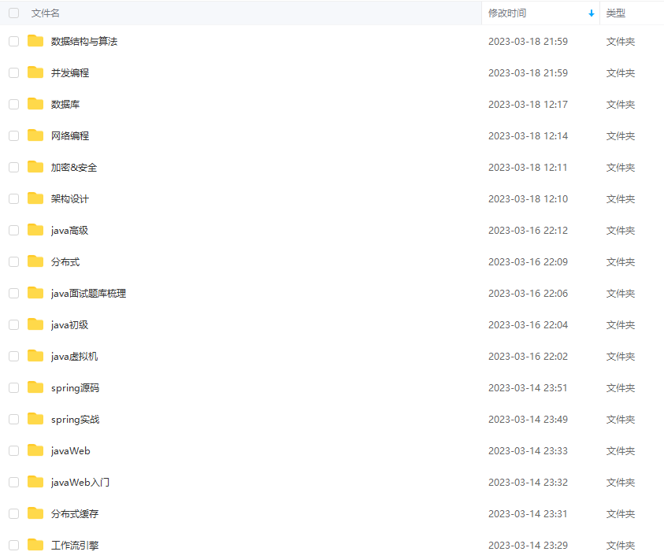
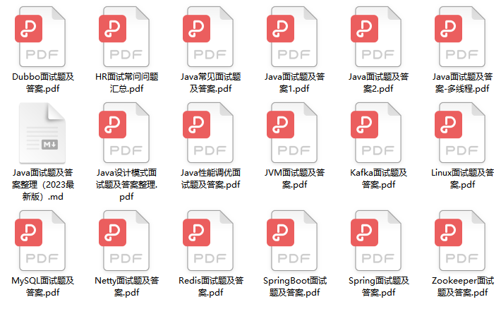

## 工具分享
> [!WARNING]
> 免费提供Java开发生态所需的全套插件，本专题大多工具都是是个人多年开发中从网上搜罗，`请勿用于任何商业用途，后果自负`，如涉及侵权或有错误之处，及时 [联系本人](http://1.13.182.252:8090/) 。

### Idea2022所有版本全家桶在线激活
>链接：https://pan.baidu.com/s/1UDtEqHEzRHJIeYZ07G1bvg?pwd=vc05
>提取码：vc05
 
```text
链接：https://pan.baidu.com/s/1UDtEqHEzRHJIeYZ07G1bvg?pwd=vc05
提取码：vc05
```


##### [更多工具解锁>>](http://1.13.182.252:8090/)

## 资料分享
### Java电子书免费获取


##### [全套电子书解锁>>](http://1.13.182.252:8090/)

### Java最新面试题免费获取
> [!DANGER]
> 包括 Java 集合、JVM、多线程、并发编程、设计模式、Spring全家桶、Java、MyBatis、ZooKeeper、Dubbo、Elasticsearch、Memcached、MongoDB、Redis、MySQL、RabbitMQ、Kafka、Linux、Netty、Tomcat、Python、HTML、CSS、Vue、React、JavaScript、Android 大数据、阿里巴巴等大厂面试题等、等技术栈！


> [!INFO]
> 文档参考 https://www.codenong.com/cs107071378/

> docsify 安装教程
> http://www.manongjc.com/detail/62-brepmlbtwkrlgqw.html

> 环境变量配置:
> https://blog.csdn.net/he_xin2009/article/details/124626268
> docsify 官网
> https://docsify.js.org/#/zh-cn/