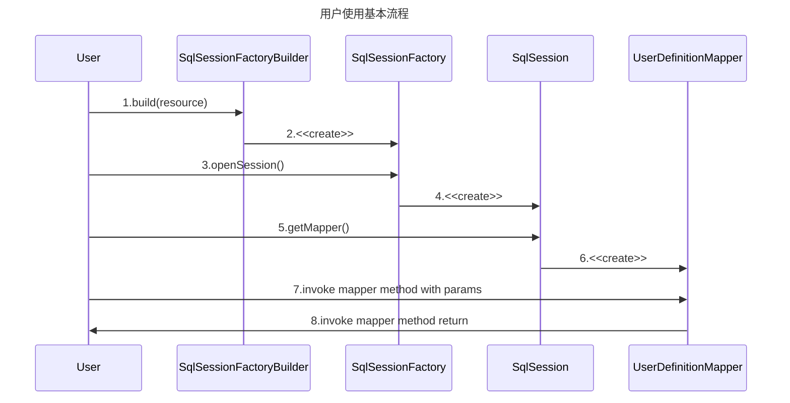
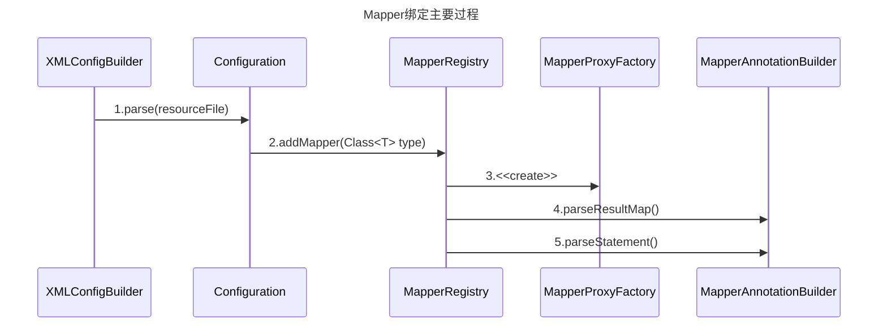

mybatis作为一个轻量级ORM框架，主要用来将SQL与java代码分离，使得SQL易于维护，并且十分灵活。



Mybatis配置

- [properties](https://mybatis.org/mybatis-3/configuration.html#properties)

- [settings](https://mybatis.org/mybatis-3/configuration.html#settings)

- [typeAliases](https://mybatis.org/mybatis-3/configuration.html#typeAliases)

- [typeHandlers](https://mybatis.org/mybatis-3/configuration.html#typeHandlers)

- [objectFactory](https://mybatis.org/mybatis-3/configuration.html#objectFactory)

- [plugins](https://mybatis.org/mybatis-3/configuration.html#plugins)

- environments
  - environment
    - transactionManager
    - dataSource
  
- [databaseIdProvider](https://mybatis.org/mybatis-3/configuration.html#databaseIdProvider)

- [mappers](https://mybatis.org/mybatis-3/configuration.html#mappers)


###### 1.Mybatis的核心就是自动绑定用户的接口与mapper中的sql实现，在加载mybatis核心配置的时候，做了Mapper接口解析和接口对应XML文件解析。

- Configuration会使用一个MapperRegister类保存了所有接口的代理工厂，用户实际操作的Mapper接口实现类都是由该工厂创建出的MapperProxy。
- 同时Configuration类会解析所有Mapper接口对应的XML文件，例如使用Map<String, ParameterMap> parameterMaps保存ParameterMap，Map<String, ResultMap> resultMaps保存ResultMap，Map<String, MappedStatement> mappedStatements保存MappedStatement等。



###### 2.使用SqlSession获取Mapper接口的时候，实际会调用MapperRegistry获取到MapperProxyFactory，由MapperProxyFactory来创建接口代理类MapperProxy。

```mermaid
sequenceDiagram
Title: 
SqlSession->>Configuration: 6. getMapper()
Configuration->>MapperRegistry: 7.getMapper()
MapperRegistry->>MapperProxyFactory: 8.get()
MapperProxyFactory->>MapperProxy: 9.<<create>> 
```
###### 3.当调用Mapper接口的方法时实际上会调用到MapperProxy代理的invoke方法生成MapperMethod，MapperMethod会生成SqlCommand对象和MethodSignature对象，其中SqlCommand对象使用命令模式封装方便与不同的SQL执行，MethodSignature主要用来生成Mapper接口的参数，然后执行execute方法，该方法会通过SqlSession的实现类例如DefaultSqlSession会使用第1步中Configuration的mappedStatements来获取MappedStatement，最后由SqlSession获取到具体的Executor来提交MappedStatement生成的SQL和MethodSignature生成的参数。

```mermaid
sequenceDiagram
Title: 

MapperProxy->>MapperMethod: 10.<<create>> 
MapperMethod->>SqlCommand:4.parseResultMap()
MapperMethod->>MethodSignature:5.parseStatement()
MapperMethod->>MapperMethod:6.execute()
MapperMethod->>SqlSession:7.selectList()
SqlSession->>MappedStatement:8.get()
SqlSession->>Executor:9.query()
```