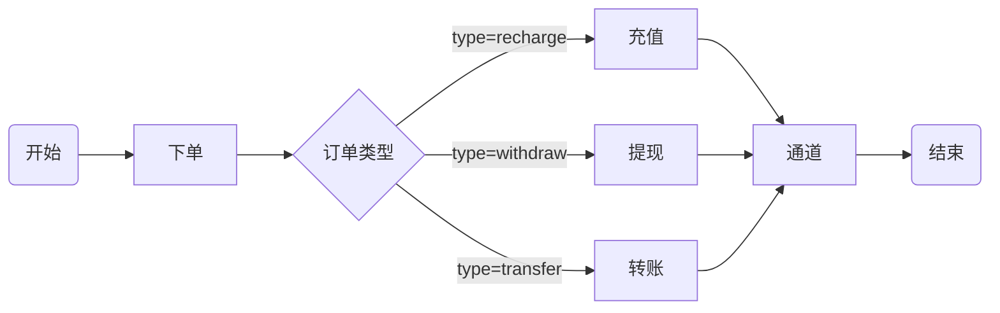
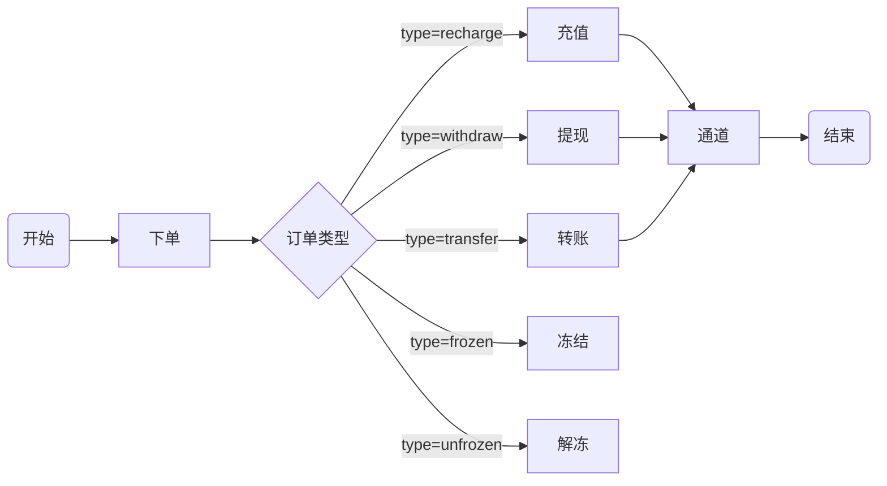
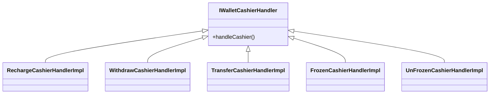
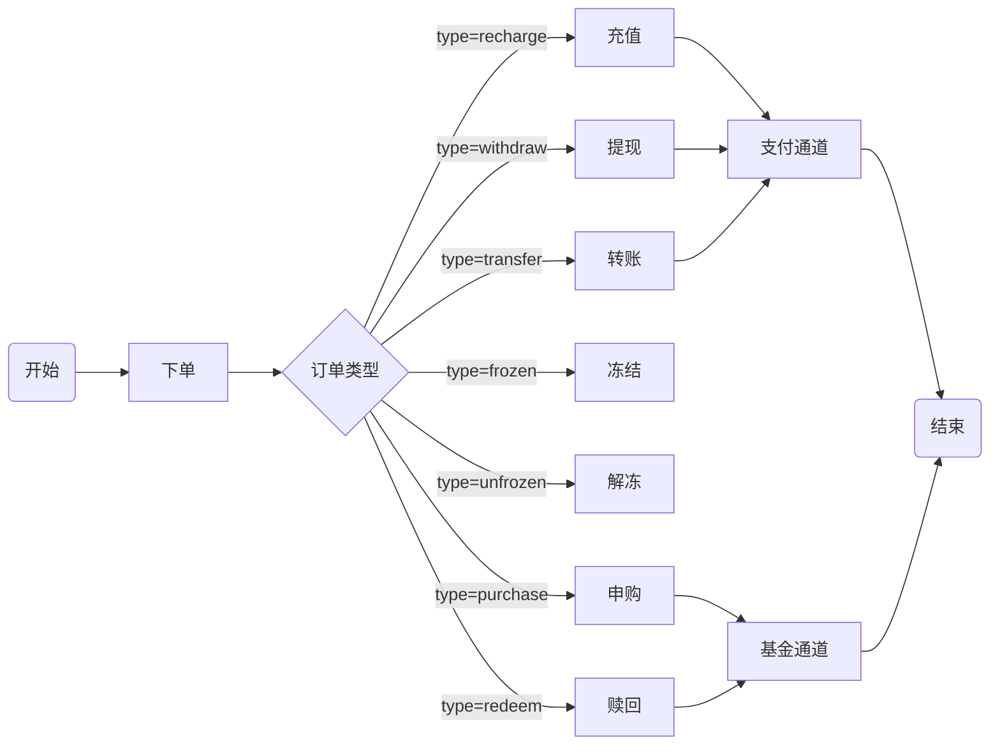
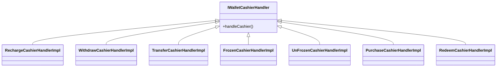
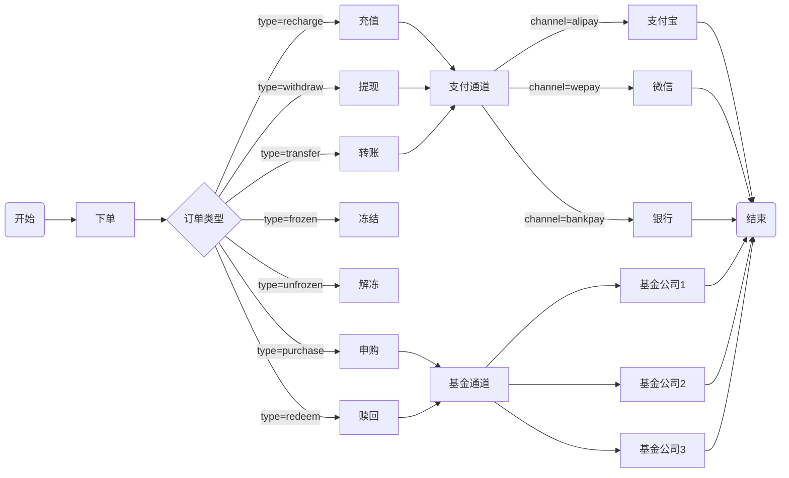
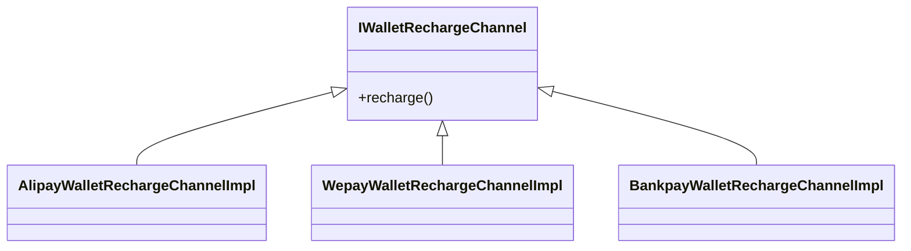
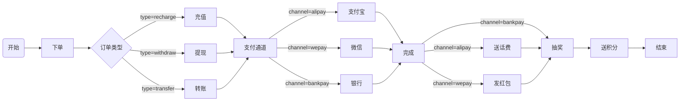
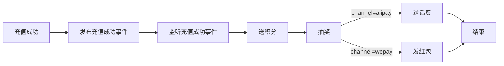
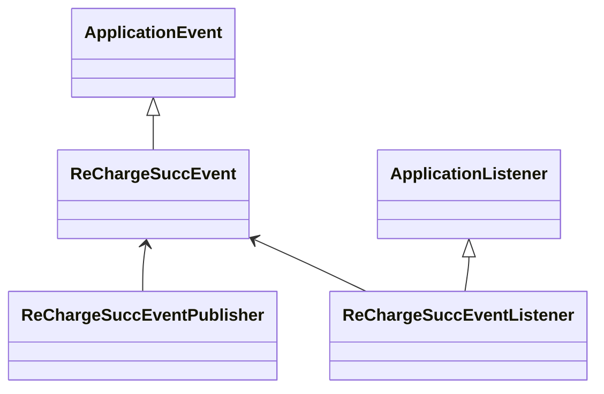

# 2020总结

###  利用框架优雅开发业务代码  [demo地址](https://github.com/xiaowj888/bcode-demo.git)

#### 场景描述

利用spring的beanfactory可以非常方便的使用工厂，责任链，策略，订阅发布等模式来实现可扩展的业务模型。

假设现在有一种钱包业务，用户可以通过订单来驱动钱包余额的充值，转账，提现功能



#### 1. 使用责任链来处理扩展

##### 1.1版本一

由于业务刚开始并不知道后续会如何扩展，我们采取直接实现的方式可能会这样写，完成第一个版本：

```java
@Override
public void submitOrder(WalletOrderSubmitReq request) {
    // 构建钱包订单
    WalletOrderDO walletOrderDO = walletOrderBuilder.buildWalletOrder(request);
    // 保存订单
    walletOrderDao.insert(walletOrderDO);
    // 转换得到现金操作DTO
    WalletCashierTxDTO walletCashierTxDto = walletOrderConverter.convertWalletOrder(walletOrderDO);
    if(null != walletCashierTxDto && null != walletCashierTxDto.getCashierTxTypeEnum()){
        // 充值
        if(WalletCashierTxTypeEnum.RECHARGE == walletCashierTxDto.getCashierTxTypeEnum()){
            //recharge()
        }
        // 提现
        else if(WalletCashierTxTypeEnum.WITHDRAW == walletCashierTxDto.getCashierTxTypeEnum()){
            //withdraw()
        }
        // 转账
        else if(WalletCashierTxTypeEnum.TRANSFER == walletCashierTxDto.getCashierTxTypeEnum()){
            //transfer()
        }
        else {
            logger.warn("未知现金交易类型{}不处理",walletCashierTxDto.getCashierTxTypeEnum());
        }
    }
}
```
##### 1.2版本二
版本一的实现逻辑没有问题，只是在操作并不很多的情况下，阅读起来已经感觉到判断分支比较多，有点费劲，在使用if判断的时候可以使用反向操作，不满足条件的直接return，并且尽量保持if平级能减少的else分支尽量减少，if优化后得到第二个版本：

```java
@Override
public void submitOrder(WalletOrderSubmitReq request) {
    // 构建钱包订单
    WalletOrderDO walletOrderDO = walletOrderBuilder.buildWalletOrder(request);
    // 保存订单
    walletOrderDao.insert(walletOrderDO);
    // 转换得到现金操作DTO
    WalletCashierTxDTO walletCashierTxDto = walletOrderConverter.convertWalletOrder(walletOrderDO);
    if(null == walletCashierTxDto || null == walletCashierTxDto.getCashierTxTypeEnum()) {
        return;
    }
    // 充值
    if(WalletCashierTxTypeEnum.RECHARGE == walletCashierTxDto.getCashierTxTypeEnum()){
        //recharge()
    }
    // 提现
    if(WalletCashierTxTypeEnum.WITHDRAW == walletCashierTxDto.getCashierTxTypeEnum()){
        //withdraw()
    }
    // 转账
    if(WalletCashierTxTypeEnum.TRANSFER == walletCashierTxDto.getCashierTxTypeEnum()){
        //transfer()
    }
}
```
##### 1.3版本三
使用版本二可以很直观的定位到具体三种操作，但是判断条件比较冗长和生硬，如果别的地方也要区分是否充值需要再次判断枚举值，可以将判断提取到dto内部增加可读性：
```java
@Override
public void submitOrder(WalletOrderSubmitReq request) {
    // 构建钱包订单
    WalletOrderDO walletOrderDO = walletOrderBuilder.buildWalletOrder(request);
    // 保存订单
    walletOrderDao.insert(walletOrderDO);
    // 转换得到现金操作DTO
    WalletCashierTxDTO walletCashierTxDto = walletOrderConverter.convertWalletOrder(walletOrderDO);
    if(null == walletCashierTxDto) {
        return;
    }
    // 充值
    if(walletCashierTxDto.isRecharge()){
        //recharge()
    }
    // 提现
    if(walletCashierTxDto.isWithDraw()){
        //withdraw()
    }
    // 转账
    if(walletCashierTxDto.isTransfer()){
        //transfer()
    }
}
```

如果针对现金操作，只有充值，提现，转账三种操作，当前的代码在阅读上也是没有问题的（真的是太棒了），不过往往随着公司发展，业务会不断的扩展（单纯的扩展还好，就怕主流程调整），钱包业务需要支持金额冻结和解冻操作：



聪明的你肯定会想到这不很简单么，不就是加两个if判断？
```java
@Override
public void submitOrder(WalletOrderSubmitReq request) {
    // 构建钱包订单
    WalletOrderDO walletOrderDO = walletOrderBuilder.buildWalletOrder(request);
    // 保存订单
    walletOrderDao.insert(walletOrderDO);
    // 转换得到现金操作DTO
    WalletCashierTxDTO walletCashierTxDto = walletOrderConverter.convertWalletOrder(walletOrderDO);
    if(null == walletCashierTxDto) {
        return;
    }
    // 充值
    if(walletCashierTxDto.isRecharge()){
        //recharge()
    }
    // 提现
    if(walletCashierTxDto.isWithDraw()){
        //withdraw()
    }
    // 转账
    if(walletCashierTxDto.isTransfer()){
        //transfer()
    }
    // 冻结
    if(walletCashierTxDto.isFrozen()){
        //frozen()
    }
    // 解冻
    if(walletCashierTxDto.isUnFrozen()){
        //unfrozen()
    }
}
```
##### 1.4版本四
那如果钱包需要支持购买基金，充话费，再加if？除了加if没有别的招了么，作为号称多年开发经验的工程师，不要面子的么。由于已经积累了一次业务扩展的经验，聪明的你肯定想到后续钱包业务可能会持续扩展，因此可以将钱包操作抽象成一个操作接口（或者命令接口），具体的充值，转账等都是接口的实现。

```java
public interface IWalletCashierHandler {
    /**
     * 处理现金操作
     * @param walletCashierTxDto 现金操作参数
     */
    void handleCashier(WalletCashierTxDTO walletCashierTxDto);
}

public class RechargeCashierHandlerImpl implements IWalletCashierHandler {
    private Logger logger = LoggerFactory.getLogger(getClass());
    public void handleCashier(WalletCashierTxDTO walletCashierTxDto){
        if(walletCashierTxDto.isRecharge()){
            logger.info("执行充值操作{}",walletCashierTxDto);
        }
    }
}

public class WithdrawCashierHandlerImpl implements IWalletCashierHandler {
    private Logger logger = LoggerFactory.getLogger(getClass());
    public void handleCashier(WalletCashierTxDTO walletCashierTxDto){
        if(walletCashierTxDto.isWithDraw()){
            logger.info("执行提现操作{}",walletCashierTxDto);
        }
    }
}

public class TransferCashierHandlerImpl implements IWalletCashierHandler {
    private Logger logger = LoggerFactory.getLogger(getClass());
    public void handleCashier(WalletCashierTxDTO walletCashierTxDto){
        if(walletCashierTxDto.isTransfer()){
            logger.info("执行转账操作{}",walletCashierTxDto);
        }
    }
}

public class FrozenCashierHandlerImpl implements IWalletCashierHandler {
    private Logger logger = LoggerFactory.getLogger(getClass());
    public void handleCashier(WalletCashierTxDTO walletCashierTxDto){
        if(walletCashierTxDto.isFrozen()){
            logger.info("执行冻结操作{}",walletCashierTxDto);
        }
    }
}

public class UnFrozenCashierHandlerImpl implements IWalletCashierHandler {
    private Logger logger = LoggerFactory.getLogger(getClass());
    public void handleCashier(WalletCashierTxDTO walletCashierTxDto){
        if(walletCashierTxDto.isUnFrozen()){
            logger.info("执行解冻操作{}",walletCashierTxDto);
        }
    }
}
```

抽象后可以得到新的主流程版本：
```java
@Resource
private List<IWalletCashierHandler> walletCashierHandlerList;

@Override
public void submitOrder(WalletOrderSubmitReq request) {
    // 构建钱包订单
    WalletOrderDO walletOrderDO = walletOrderBuilder.buildWalletOrder(request);
    // 保存订单
    walletOrderDao.insert(walletOrderDO);
    // 转换得到现金操作DTO
    WalletCashierTxDTO walletCashierTxDto = walletOrderConverter.convertWalletOrder(walletOrderDO);
    if(null == walletCashierTxDto) {
        return;
    }
    walletCashierHandlerList.forEach(handler -> handler.handleCashier(walletCashierTxDto));
}
```
##### 1.5版本五
后续随着业务发展，钱包可能需要支持基金申购，赎回等业务操作：


主流程不需要调整，只需要新增两种操作实现类



```java
@Component
public class PurchaseCashierHandlerImpl implements IWalletCashierHandler {
    private Logger logger = LoggerFactory.getLogger(getClass());
    public void handleCashier(WalletCashierTxDTO walletCashierTxDto){
        if(walletCashierTxDto.isWithDraw()){
            logger.info("执行申购操作{}",walletCashierTxDto);
        }
    }
}
@Component
public class RedeemCashierHandlerImpl implements IWalletCashierHandler {
    private Logger logger = LoggerFactory.getLogger(getClass());
    public void handleCashier(WalletCashierTxDTO walletCashierTxDto){
        if(walletCashierTxDto.isWithDraw()){
            logger.info("执行赎回操作{}",walletCashierTxDto);
        }
    }
}
```

主流程代码不需要改动，使用当前的方式可以做到有新的业务扩展时候只需要动态的扩展IWalletCashierHandler接口的实现即可，这种处理方式与filter，interceptor一样，典型的链式处理。链式处理每次都会遍历所有的实现类，判断是否属于当前的处理范围，如果是则执行当前的实现方法。
```java
@Resource
private List<IWalletCashierHandler> walletCashierHandlerList;

@Override
public void submitOrder(WalletOrderSubmitReq request) {
    // 构建钱包订单
    WalletOrderDO walletOrderDO = walletOrderBuilder.buildWalletOrder(request);
    // 保存订单
    walletOrderDao.insert(walletOrderDO);
    // 转换得到现金操作DTO
    WalletCashierTxDTO walletCashierTxDto = walletOrderConverter.convertWalletOrder(walletOrderDO);
    if(null == walletCashierTxDto) {
        return;
    }
    walletCashierHandlerList.forEach(handler -> handler.handleCashier(walletCashierTxDto));
}
```

#### 2. 使用策略模式

在使用链式处理的时候每次需要遍历所有的实现类，在spring中我们可以直接获取到指定的某个实现类来完成操作。

##### 2.1 版本一

​	使用spring的@Qualifier注解可以找到某个接口的指定实现类，@Qualifier注解相当于给指定的实现类打上了一个【标签】

```java
@Component
@Qualifier(value = "RECHARGE")
public class RechargeCashierHandlerImpl implements IWalletCashierHandler {
    private Logger logger = LoggerFactory.getLogger(getClass());
    public void handleCashier(WalletCashierTxDTO walletCashierTxDto){
        if(walletCashierTxDto.isRecharge()){
            logger.info("执行充值操作{}",walletCashierTxDto);
        }
    }
}
@Resource
@Qualifier("RECHARGE")
private IWalletCashierHandler walletCashierHandler;

@Override
public void submitOrder(WalletOrderSubmitReq request) {
    // 构建钱包订单
    WalletOrderDO walletOrderDO = walletOrderBuilder.buildWalletOrder(request);
    // 保存订单
    walletOrderDao.insert(walletOrderDO);
    // 转换得到现金操作DTO
    WalletCashierTxDTO walletCashierTxDto = walletOrderConverter.convertWalletOrder(walletOrderDO);
    if(null == walletCashierTxDto) {
        return;
    }
    walletCashierHandler.handleCashier(walletCashierTxDto);
}
```

使用该中方式每次只能将注入写死到特定的接口，无法动态根据条件找到某个实现。由版本一我们发现spring已经提供了基于注解给某个bean【打标】只是欠缺了一段根据动态的条件找到实现类的逻辑。众所周知spring为开发者预留了很多扩展接口，当需要使用的某个功能spring没有直接提供的时候，应该优先考虑spring的扩展接口。通过对查看spring ApplicationContext接口发现其继承的ListableBeanFactory提供了两个方法
```java
//找到包含某个注解的所有bean
Map<String, Object> getBeansWithAnnotation(Class<? extends Annotation> annotationType) throws BeansException;

//找到某个bean上的某个注解
@Nullable
<A extends Annotation> A findAnnotationOnBean(String beanName, Class<A> annotationType)
    throws NoSuchBeanDefinitionException;

```
##### 2.2 版本二
定义一个@Strategy注解，为啥不用@Qualifier？@Qualifier为spring内置注解，已经有了指定的使用场景。
```java
@Target({ElementType.FIELD, ElementType.METHOD, ElementType.PARAMETER, ElementType.TYPE, ElementType.ANNOTATION_TYPE})
@Retention(RetentionPolicy.RUNTIME)
@Inherited
@Documented
public @interface Strategy {
	//策略名称;支持多个条件
	String[] values();
	//策略接口
	Class<?> strategyInterface();
}
```
给所有的实现类都带上自定义注解
```java
@Component
@Strategy(values = "RECHARGE")
public class RechargeCashierHandlerImpl implements
IWalletCashierHandler 

@Component
@Strategy(values = "WITHDRAW")
public class WithdrawCashierHandlerImpl implements IWalletCashierHandler

@Strategy(values = "TRANSFER")
public class TransferCashierHandlerImpl implements IWalletCashierHandler

@Component
@Strategy(values = "FROZEN")
public class FrozenCashierHandlerImpl implements IWalletCashierHandler

@Component
@Strategy(values = "UNFROZEN")
public class UnFrozenCashierHandlerImpl implements IWalletCashierHandler

@Component
@Strategy(values = "PURCHASE")
public class PurchaseCashierHandlerImpl implements IWalletCashierHandler	

@Component
@Strategy(values = "REDEEM")
public class RedeemCashierHandlerImpl implements IWalletCashierHandler 
```
定义一个策略工厂，初始化的时候将所有@Strategy注解的实现，放到一个map中
```java
@Component
public class StrategyFactory implements ApplicationContextAware {
    //key为策略的value 值为bean的应用
    private final Map<String,Object> strategyMap = new HashMap<>();
    @Override
    public void setApplicationContext(ApplicationContext applicationContext) throws BeansException {
        //获取所有注解的实现
        Map<String, Object> beansWithAnnotationMap = applicationContext
            .getBeansWithAnnotation(Strategy.class);
        beansWithAnnotationMap.forEach((beanName,strategyBean) -> {
            //获取bean上的注解
            Strategy strategyAnnotation = applicationContext
                .findAnnotationOnBean(beanName, Strategy.class);
            if(null == strategyAnnotation){
                return;
            }
            for(String value:strategyAnnotation.values()){
                strategyMap.put(value,strategyBean);
            }
        });
    }

    public <T> T getStrategy(String strategyValue, Class<T> strategyInterface){
        Object strategyBean = strategyMap.get(strategyValue);
        if(null == strategyBean){
            throw new RuntimeException(String.format("没有找到策略【%s】",strategyValue));
        }
        if(! (strategyInterface.isAssignableFrom(strategyBean.getClass()))){
            throw new RuntimeException(
                String.format("策略【%s】类型【%s】与真实类型【%s】不匹配",strategyValue,
                strategyBean.getClass().getCanonicalName(),strategyInterface.getCanonicalName()));
        }
        return (T)strategyBean;
    }
}
```
使用策略工厂执行主流程
```java
@Resource
private StrategyFactory strategyFactory;

@Override
public void submitOrder(WalletOrderSubmitReq request) {
    // 构建钱包订单
    WalletOrderDO walletOrderDO = walletOrderBuilder.buildWalletOrder(request);
    // 保存订单
    walletOrderDao.insert(walletOrderDO);
    // 转换得到现金操作DTO
    WalletCashierTxDTO walletCashierTxDto = walletOrderConverter.convertWalletOrder(walletOrderDO);
    if(null == walletCashierTxDto) {
        return;
    }
  strategyFactory.getStrategy(walletCashierTxDto.getCashierTxTypeEnum().name(),
                              IWalletCashierHandler.class).handleCashier(walletCashierTxDto);
}
```

使用策略模式可以根据条件找到指定的接口实现，所以接口内部不需要再加是否属于该实现范围的判断,以充值为例:
```java
@Component
@Strategy(values = "RECHARGE")
public class RechargeCashierHandlerImpl implements IWalletCashierHandler {
    private Logger logger = LoggerFactory.getLogger(getClass());
    public void handleCashier(WalletCashierTxDTO walletCashierTxDto){
       logger.info("执行充值操作{}",walletCashierTxDto);
    }
}

```
##### 2.3 版本三 
随着业务进一步发展，钱包可能需要对接多个支付通道，比如场景的有支付宝，微信，银行等

可以发现伴随着业务发展，之前简单的充转提操作，都需要支持多通道，以充值为例，需要支持使用支付宝充值，微信充值，银行充值等方式，基于策略的方式需要将充值操作进行抽象，多种通道对应多种实现。

充值业务的实现
```java
/**
 * @program: wallet
 * @description: 钱包充值通道接口
 * @author: xiaowj
 * @created: 2021-02-03
 **/
public interface IWalletRechargeChannel {
    void recharge(WalletRechargeTxDTO rechargeDto);
}

@Component
@Strategy(values = "ALIPAY")
public class AlipayWalletRechargeChannelImpl implements IWalletRechargeChannel {
    private Logger logger = LoggerFactory.getLogger(getClass());
    @Override
    public void recharge(WalletRechargeTxDTO rechargeDto) {
        logger.info("使用支付宝充值");
    }
}

@Component
@Strategy(values = "WEPAY")
public class WepayWalletRechargeChannelImpl implements IWalletRechargeChannel {
    private Logger logger = LoggerFactory.getLogger(getClass());
    @Override
    public void recharge(WalletRechargeTxDTO rechargeDto) {
        logger.info("使用微信充值");
    }
}

@Component
@Strategy(values = "BANKPAY")
public class BankpayWalletRechargeChannelImpl implements IWalletRechargeChannel {
    private Logger logger = LoggerFactory.getLogger(getClass());
    @Override
    public void recharge(WalletRechargeTxDTO rechargeDto) {
        logger.info("使用银行卡充值");
    }
}

@Component
@Strategy(values = "RECHARGE")
public class RechargeCashierHandlerImpl implements IWalletCashierHandler {
    private Logger logger = LoggerFactory.getLogger(getClass());

    @Resource
    private StrategyFactory strategyFactory;

    public void handleCashier(WalletCashierTxDTO walletCashierTxDto){
        logger.info("执行充值操作{}",walletCashierTxDto);
        WalletRechargeTxDTO recharge = WalletRechargeConverter.INSTANCE.convertToWalletRecharge(walletCashierTxDto);
        strategyFactory.getStrategy(recharge.getChannelEnum().name(), IWalletRechargeChannel.class)
                .recharge(recharge);
    }
}
```
#### 3. 使用订阅发布解耦
终于经历了过个版本的迭代，红包系统接入了多个通道，开始正式运营。项目上线初期，钱包系统活跃用户并不多，为了短时间内吸引用户，运营打算活动推广。
1，所有用户充值成功，给用户积累等额积分。
2，所有充值成功可以参与在线抽奖活动。
3，如果使用微信支付，返现金红包。
4，如果使用支付宝支付，随机送话费。

将用户充值完成，用户积分，用户话费，用户红包，用户抽奖等活动单独的抽到service中实现如下
```java
@Service
public class UserNotifyService {
    private Logger logger = LoggerFactory.getLogger(getClass());
    public void notifyUser(String msg){
        logger.info("通知用户订单完成{}",msg);
    }
}

@Service
public class UserPointManageService {
    private Logger logger = LoggerFactory.getLogger(getClass());
    public void giveUserPoint(String msg){
        logger.info("赠送用户积分{}",msg);
    }
}

@Service
public class UserPhoneChargeManageService {
    private Logger logger = LoggerFactory.getLogger(getClass());
    public void giveUserPhoneCharge(String msg){
        logger.info("赠送话费{}",msg);
    }
}

@Service
public class UserRedPacketManageService {
    private Logger logger = LoggerFactory.getLogger(getClass());
    public void giveUserRedPacket(String msg){
        logger.info("用户发送红包{}",msg);
    }
}

@Service
public class UserLuckyDrawManageService {
    private Logger logger = LoggerFactory.getLogger(getClass());
    public void giveLuckyDraw(String msg){
        logger.info("用户抽奖{}",msg);
    }
}
```
##### 3.1版本一
直接调用各个活动的实现，完成钱包做活动推广业务,用户充值的代码得这样写。
```java
@Resource
private StrategyFactory strategyFactory;
@Resource
private UserNotifyService userNotifyService;
@Resource
private UserPointManageService userPointManageService;
@Resource
private UserLuckyDrawManageService userLuckyDrawManageService;

public void handleCashier(WalletCashierTxDTO walletCashierTxDto){
logger.info("执行充值操作{}",walletCashierTxDto);
WalletRechargeTxDTO  recharge=WalletRechargeConverter.INSTANCE
    .convertToWalletRecharge(walletCashierTxDto);
//执行不同的通道策略完成充值
strategyFactory
    .getStrategy(recharge.getChannelEnum().name(), IWalletRechargeChannel.class)
	.recharge(recharge);
// 订单完成通知用户
userNotifyService.notifyUser("订单完成");
// 送积分
userPointManageService.giveUserPoint("赠送积分");
// 抽奖
userLuckyDrawManageService.giveLuckyDraw("开始抽奖");
}
```
对于使用微信充值和支付宝充值需要作调整。
```java
@Component
@Strategy(values = "ALIPAY")
public class AlipayWalletRechargeChannelImpl implements IWalletRechargeChannel {
    private Logger logger = LoggerFactory.getLogger(getClass());
    @Resource
    private UserPhoneChargeManageService userPhoneChargeManageService;
    @Override
    public void recharge(WalletRechargeTxDTO rechargeDto) {
        logger.info("使用支付宝充值");
        userPhoneChargeManageService.giveUserPhoneCharge("返话费");
    }
}

@Component
@Strategy(values = "WEPAY")
public class WepayWalletRechargeChannelImpl implements IWalletRechargeChannel {
    private Logger logger = LoggerFactory.getLogger(getClass());
    @Resource
    private UserRedPacketManageService userRedPacketManageService;

    @Override
    public void recharge(WalletRechargeTxDTO rechargeDto) {
        logger.info("使用微信充值");
        // 充值完成赠送红包
        userRedPacketManageService.giveUserRedPacket("赠送红包");
    }
}
```
##### 3.1版本二
版本一虽然能够支持当前的活动推广，但是各个活动的实现类需要维护到不同的流程中，而且随着业务的变更，或者不同节假日都会采用不同的活动，如果每次调整活动都影响到主要的充值流程，会使得系统的稳定性得不到保证。为了不影响充值业务，可以将充值订单完成当成事件发布出来，根据事件的类型来决定需要给用户组合哪几种活动，达到解耦的目的，单独将活动的流程抽离出来如下。
活动：
1，所有用户充值成功，给用户积累等额积分。
2，所有充值成功可以参与在线抽奖活动。
3，如果使用微信支付，返现金红包。
4，如果使用支付宝支付，随机送话费。

可以抽象事件模型：

代码实现
```java
/**
 * @program: wallet
 * @description: 充值成功事件
 * @author: xiaowj
 * @created: 2021-01-31
 **/
public class ReChargeSuccEvent extends ApplicationEvent {
    public ReChargeSuccEvent(WalletRechargeTxDTO source) {
        super(source);
    }
}

/**
 * @program: wallet
 * @description: 充值成功事件发布器
 * @author: xiaowj
 * @created: 2021-01-31
 **/
@Component
public class ReChargeSuccEventPublisher {
    @Resource
    private ApplicationEventPublisher applicationEventPublisher;
    public void publishReChargeSuccEvent(WalletRechargeTxDTO recharge){
        applicationEventPublisher.publishEvent(recharge);
    }
}

/**
 * @program: wallet
 * @description: 充值成功事件监听器
 * @author: xiaowj
 * @created: 2021-01-31
 **/
@Component
public class ReChargeSuccEventListener implements ApplicationListener<ReChargeSuccEvent> {

    @Resource
    private UserNotifyService userNotifyService;

    @Resource
    private UserPointManageService userPointManageService;

    @Resource
    private UserLuckyDrawManageService userLuckyDrawManageService;

    @Resource
    private UserRedPacketManageService userRedPacketManageService;

    @Resource
    private UserPhoneChargeManageService userPhoneChargeManageService;

    @Override
    public void onApplicationEvent(ReChargeSuccEvent event) {
        WalletRechargeTxDTO recharge = (WalletRechargeTxDTO)event.getSource();
        // 订单完成通知用户
        userNotifyService.notifyUser("订单完成");
        // 送积分
        userPointManageService.giveUserPoint("赠送积分");
        // 抽奖
        userLuckyDrawManageService.giveLuckyDraw("开始抽奖");

        // 支付宝返话费
        if(WalletChannelEnum.ALIPAY == recharge.getChannelEnum()){
            userPhoneChargeManageService.giveUserPhoneCharge("返话费");
        }

        // 微信支付送红包
        if(WalletChannelEnum.WEPAY == recharge.getChannelEnum()){
            userRedPacketManageService.giveUserRedPacket("赠送红包");
        }
    }
}
```
原来充值的流程不需要增加任何逻辑，只需要将充值成功的事件发布出去即可。
```java
@Component
@Strategy(values = "RECHARGE")
public class RechargeCashierHandlerImpl implements IWalletCashierHandler {
    private Logger logger = LoggerFactory.getLogger(getClass());

    @Resource
    private StrategyFactory strategyFactory;

    @Resource
    private ReChargeSuccEventPublisher reChargeSuccEventPublisher;

    public void handleCashier(WalletCashierTxDTO walletCashierTxDto){
        logger.info("执行充值操作{}",walletCashierTxDto);
        WalletRechargeTxDTO recharge = WalletRechargeConverter.INSTANCE
            .convertToWalletRecharge(walletCashierTxDto);
        //执行不同的通道策略完成充值
        strategyFactory.getStrategy(recharge.getChannelEnum().name(), IWalletRechargeChannel.class)
                .recharge(recharge);

        // 充值成功发布事件
        reChargeSuccEventPublisher.publishReChargeSuccEvent(recharge);
    }
}

//支付宝充值不需要调整
@Component
@Strategy(values = "ALIPAY")
public class AlipayWalletRechargeChannelImpl implements IWalletRechargeChannel {
    private Logger logger = LoggerFactory.getLogger(getClass());

    @Override
    public void recharge(WalletRechargeTxDTO rechargeDto) {
        logger.info("使用支付宝充值");
    }
}
//微信充值不需要调整
@Component
@Strategy(values = "WEPAY")
public class WepayWalletRechargeChannelImpl implements IWalletRechargeChannel {
    private Logger logger = LoggerFactory.getLogger(getClass());
    @Override
    public void recharge(WalletRechargeTxDTO rechargeDto) {
        logger.info("使用微信充值");
    }
}

```

通过事件解耦后，后续充值的子流程不需要作调整，如果有活动变更只需要在【充值完成事件】监听器中调整逻辑。如果各种活动的组合非常复杂，还可以继续使用订阅模式拆分，比如可以将【支付宝充值完成事件】【微信充值完成事件】【银行充值完成事件】继续拆分，进一步解耦。

#### 4. 使用单独的builder或者converter工具类
实际开发过程中经常会遇到需要将DO与DTO或则VO等POJO相互转换的场景，比如需要将接口层面的请求对象转换为DB层的订单实体：
##### 4.1使用单独的构建类
```java
/**
 * @program: wallet
 * @description:构建订单
 * @author: xiaowj
 * @created: 2021-01-31
 **/
@Component
public class WalletOrderBuilder {
    public WalletOrderDO buildWalletOrder(WalletOrderSubmitReq request){
        WalletOrderDO walletOrder = new WalletOrderDO();
        walletOrder.setOrderNo("orderNo001");
        walletOrder.setOrderAmt(10L);
        walletOrder.setOrderReqNo(request.getOrderReqNo());
        walletOrder.setAccountNo(request.getAccountNo());
        walletOrder.setWalletOrderTxType(request.getOrderTxType().name());
        walletOrder.setCashierTxType(request.getCashierTxTypeEnum().name());
        walletOrder.setChannelEnum(request.getChannelEnum());
        return walletOrder;
    }
}
```

单独的builder工具类可以将构建过程解耦出来，但是会增加很多builder或则convter类，当字段太多或则需要增减字段的时候也不太好扩展。
##### 4.2使用spring BeanUtils工具类
```java
WalletOrderDO walletOrder = new WalletOrderDO();
BeanUtils.copyProperties(request,walletOrder);
```
使用工具类代码更加清爽，但是只能处理同类型同命名属性字段，而且效率也不如直接getter，setter方法。

##### 4.3使用mapstruct
具体使用直接参考[https://github.com/mapstruct/mapstruct](https://github.com/mapstruct/mapstruct)
```java
@Mapper
public interface WalletRechargeConverter {
    WalletRechargeConverter INSTANCE =
            Mappers.getMapper(WalletRechargeConverter.class);
    WalletRechargeTxDTO convertToWalletRecharge(WalletCashierTxDTO source);
}
```
