#VMware17安装CentOS Linux

## WM17安装参考

## CentOS Linux下载安装包
> 官网下载
https://www.centos.org/download/

选择X86

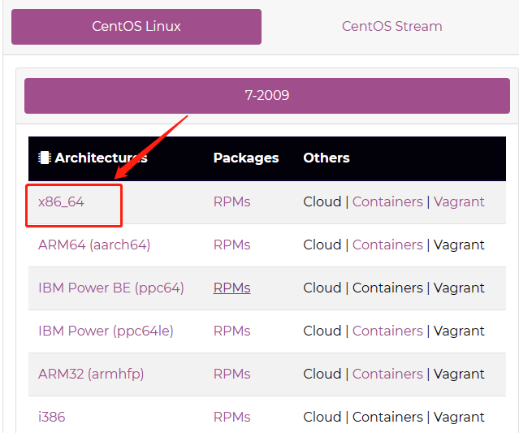 

选择一个镜像下载即可

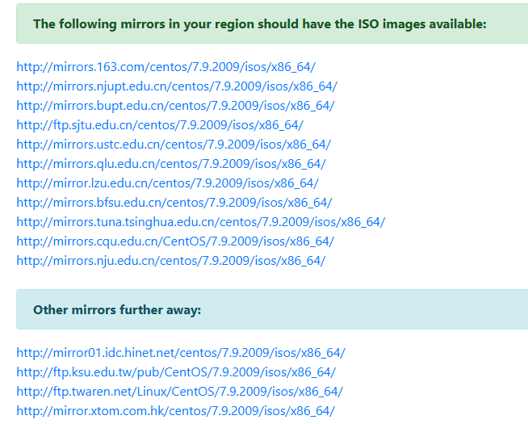

下载后的iso文件保存到本地，接下来创建虚拟机会使用到


### 创建虚拟机
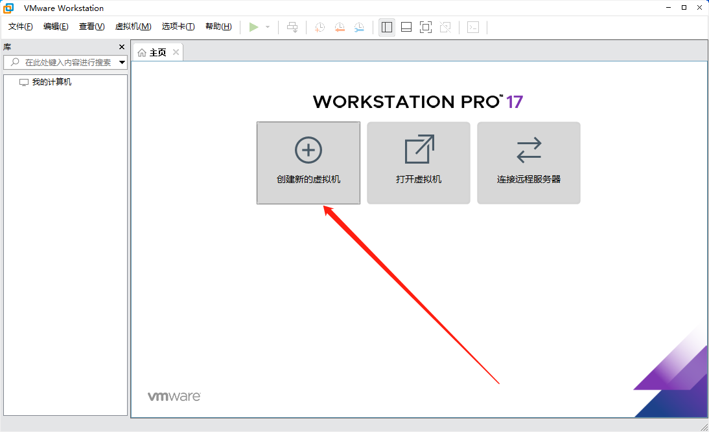


### 直接下一步就好
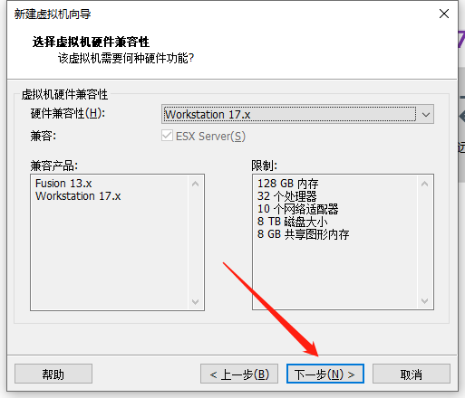

### 选择iso文件
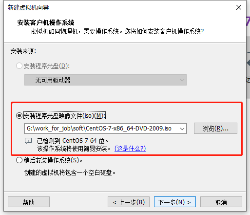

### 设置系统用户名/密码

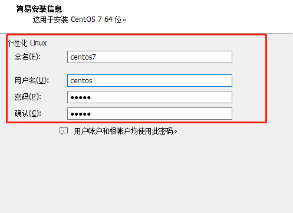

### 设置安装位置
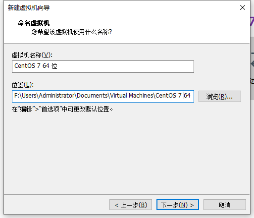

### 配置处理器
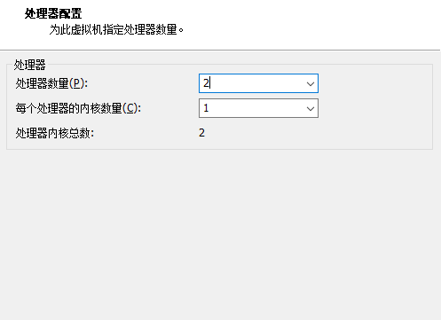

### 配置内存
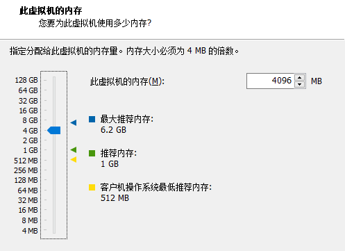

### 配置网络
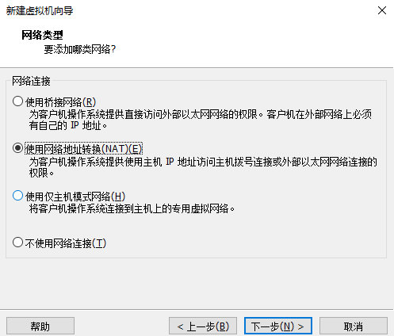

### 配置IO
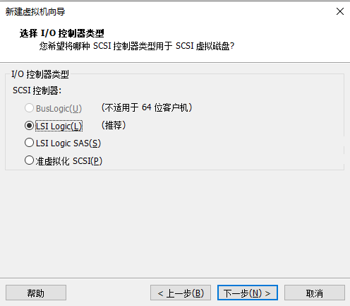

### 配置磁盘
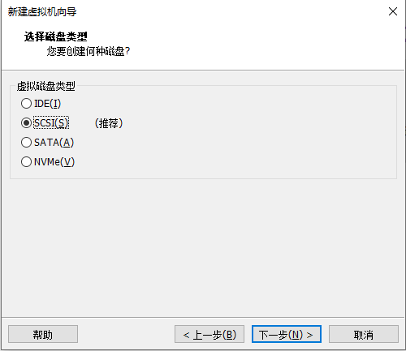
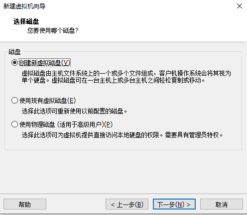


### 配置完成
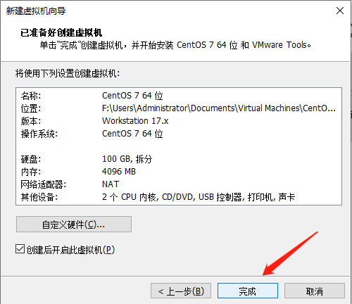

### 开启虚拟机

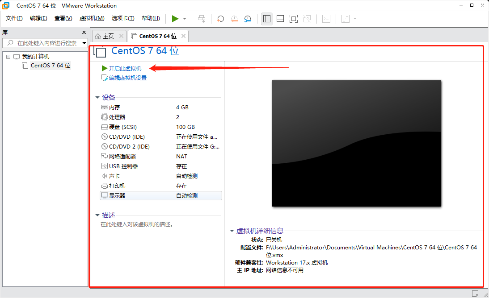


如果遇到如下错误
```aidl
此主机支持 Intel VT-x，但 Intel VT-x 处于禁用状态。
如果已在 BIOS/固件设置中禁用 Intel VT-x，或主机自更改此设置后从未重新启动，则 Intel VT-x 可能被禁用。
(1) 确认 BIOS/固件设置中启用了 Intel VT-x 并禁用了“可信执行”。
(2) 如果这两项 BIOS/固件设置有一项已更改，请重新启动主机。
(3) 如果您在安装 VMware Workstation 之后从未重新启动主机，请重新启动。
(4) 将主机的 BIOS/固件更新至最新版本。
此主机不支持“Intel EPT”硬件辅助的 MMU 虚拟化。
VMware Workstation 在此主机上不支持用户级别监控。
模块“MonitorMode”启动失败。
未能启动虚拟机。
```
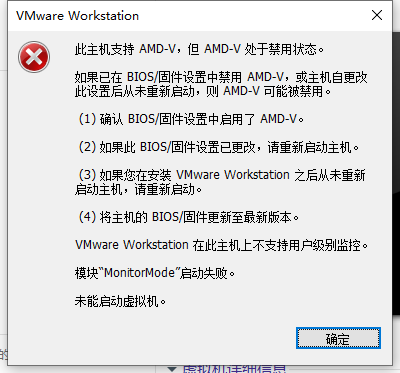

> 解决方案可以参考：https://www.xitongcheng.com/jiaocheng/xtazjc_article_38955.html

英特尔CPU的设置方法：进入BIOS后，找到“BIOSfeatures‘-Intel virtual technology”和“VT-d"选项，把”disabled“都修改为”enabled“。然后按F10保存退出即可；

AMDCPU的设置方法：进入BIOS后，找到“M.I.T”-“advanced frequency settings”-“advanced cpu core settings”-“SVM”选项。把”disabled“都修改为”enabled“。然后按F10保存退出即可；

下面以AMD450主板开启VT的方法作为演示：

### 我们进入到BIOS，点开第一行英文。
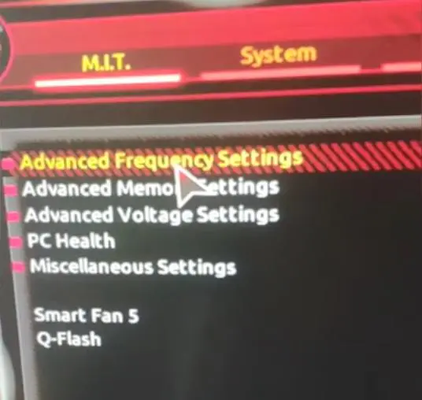

### 这个可能在不同的BIOS里边，不太一样，还是需要你自己去找的，找重要的一些英文单词，比如有CPU字样的。
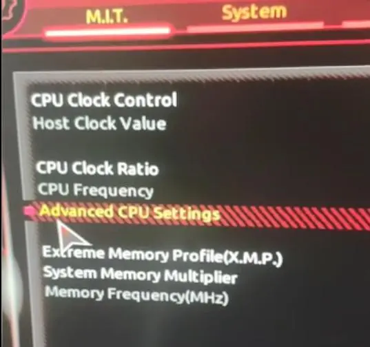

### 因为它设置的是CPU的虚拟化技术，之后找SVM选项。


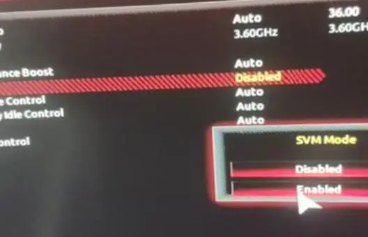
### 保存退出就可以了。


### 再次启动虚机即可
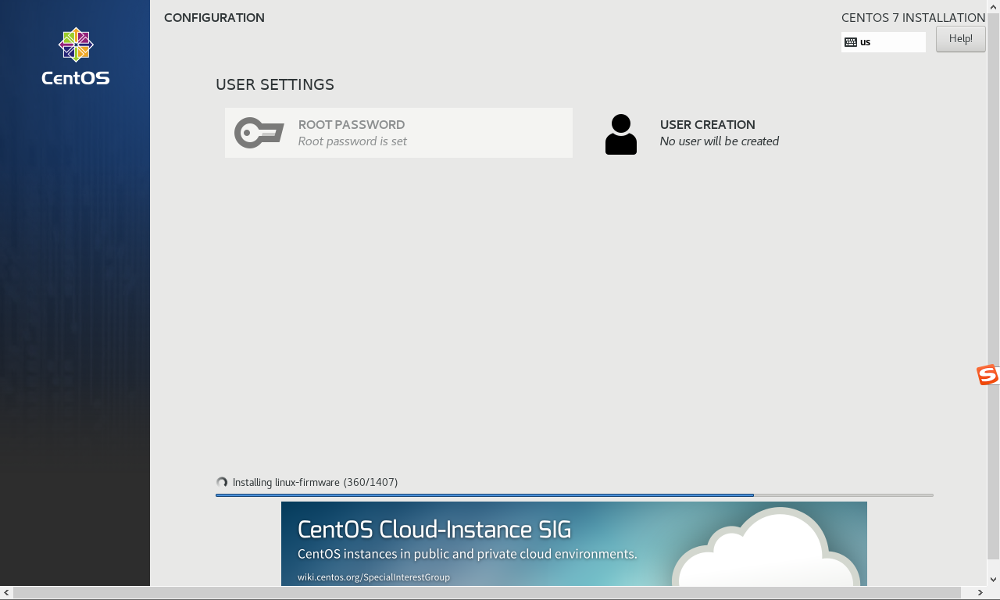

### 安装完成后输入密码解锁
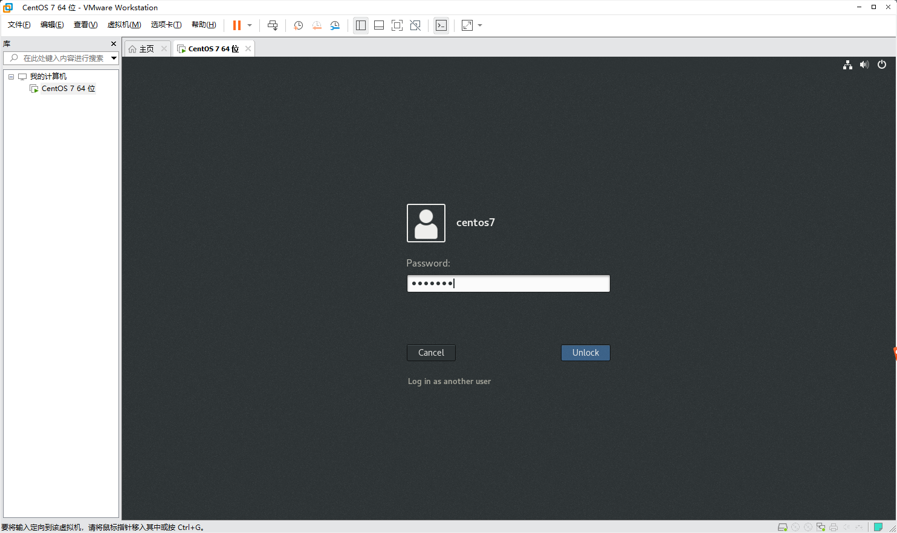

### 默认安装了openjdk8
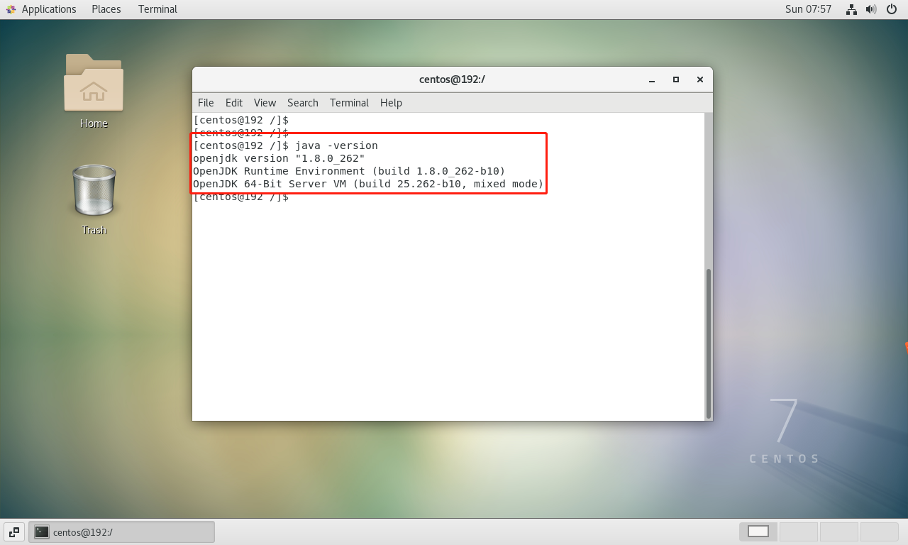
