#Windows安装VMware17

## 下载安装包
> 官网下载
https://www.vmware.com/go/getworkstation-win

> 百度网盘
链接：https://pan.baidu.com/s/1ae6mTZ57VaWbV5zU8S9Asw?pwd=sjd6
提取码：sjd6

> 激活码
> MC60H-DWHD5-H80U9-6V85M-8280D 或者 JU090-6039P-08409-8J0QH-2YR7F

### 点击安装
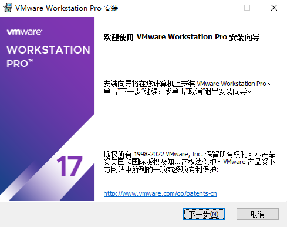

### 同意
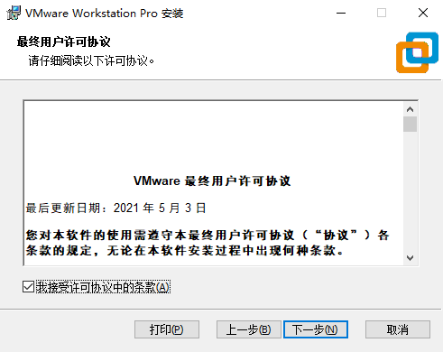

### 选择安装位置
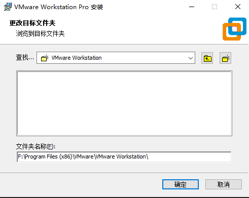

### 自定义安装
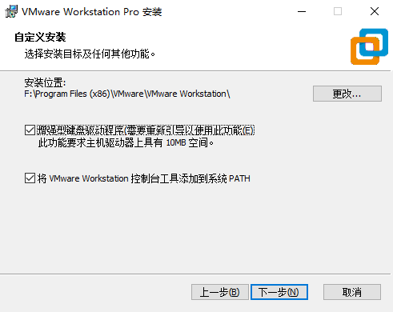

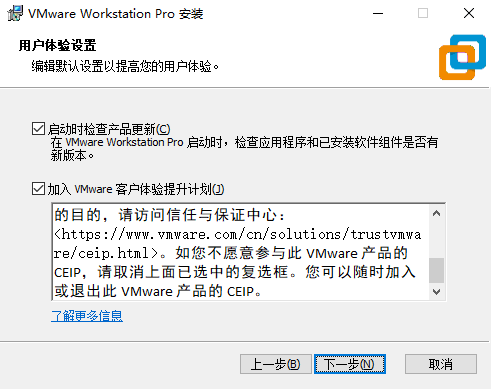

### 默认选择快捷方式
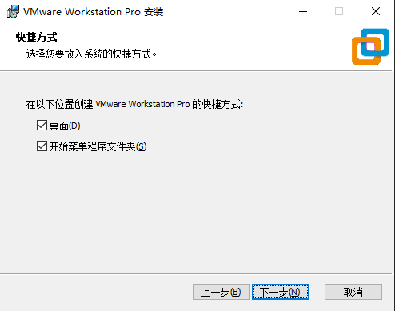

### 准备安装
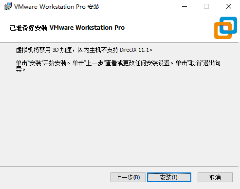

### 执行安装
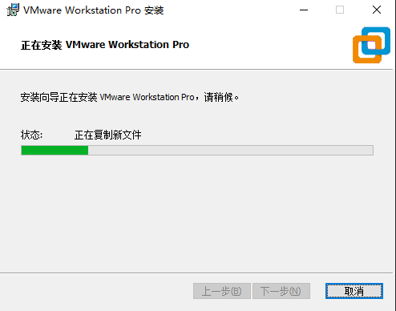

### 安装完成
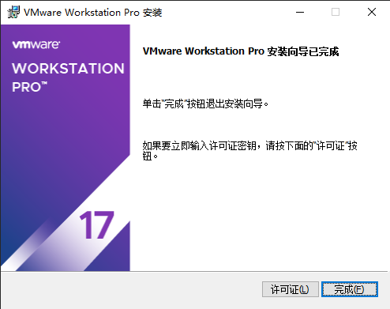

### 许可证
输入秘钥:MC60H-DWHD5-H80U9-6V85M-8280D
或者:JU090-6039P-08409-8J0QH-2YR7F
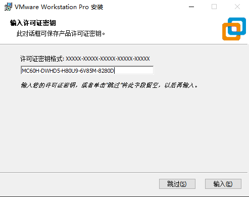

### 安装完成
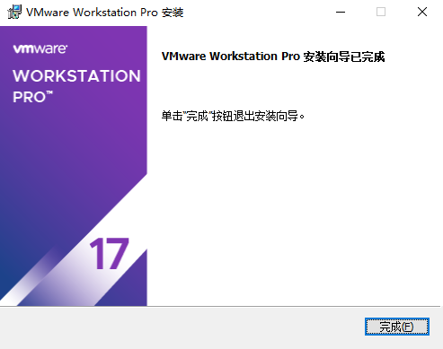