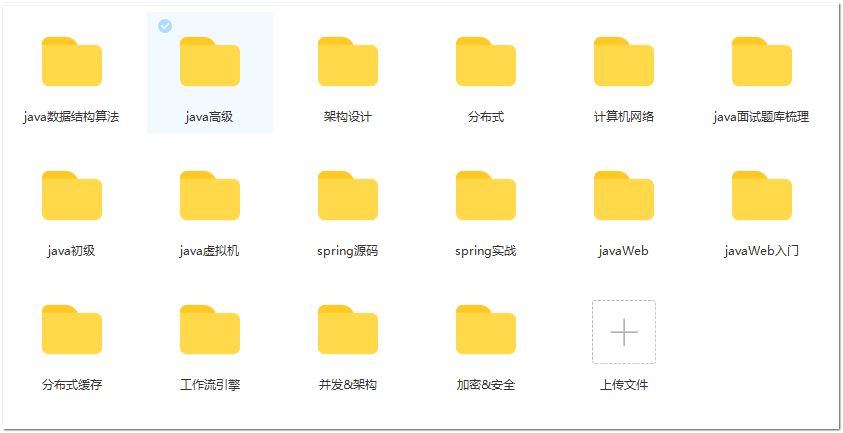
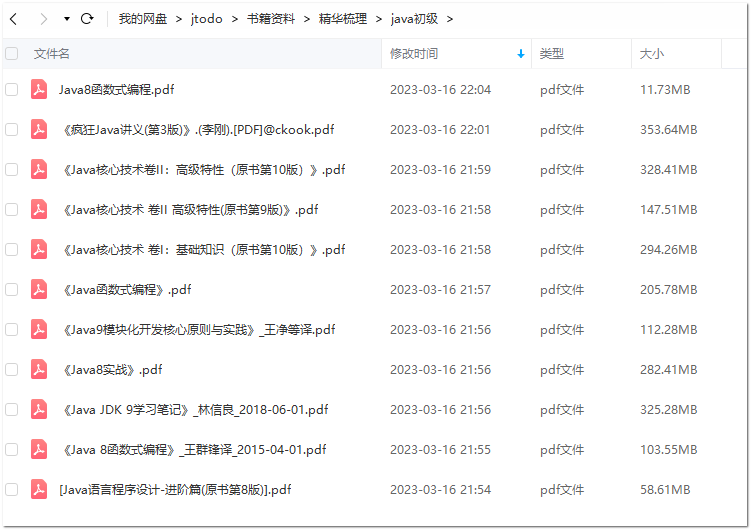
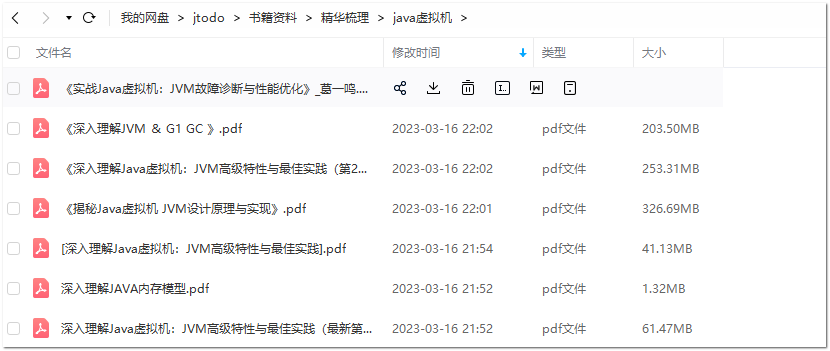
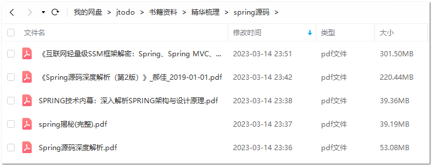

#JAVA全套电子书

> 梳理了java全套电子书，所有电子书经过层层筛选分类，方便下载获取;全部带上完整书，签方便阅读；完全免费分享用于个人学习交流，早到早得！！！

## 下载安装包
> 官网下载
https://book.douban.com/tag/Java

> 网站整理免费下载
链接：http://129.211.220.13:8090/

### 全部目录

### 书签和质量都是有保证的

### java初级

### java高级

### javaWeb

### java虚拟机

### spring实战

### spring源码

http://129.211.220.13:8090/console/#/posts

ssh 129.211.220.13 22
root
Loy489576326!

cd ~/halo

安装教程
http://1.13.182.252:8090/archives/Halo%E6%90%AD%E5%BB%BA

129.211.220.13:3306    

root/root

mysql -h 129.211.220.13 -P 3306 -u root

[mysqld]
socket=/var/lib/mysql/mysql.sock
[client]
socket=/var/lib/mysql/mysql.sock
----------------------------------

# 使用淘宝镜像
npm config set registry https://registry.npm.taobao.org
# 验证是否ok
npm config get registry

docsify 安装教程
http://www.manongjc.com/detail/62-brepmlbtwkrlgqw.html

选择安装目录:E:\software\nodejs\

在 cmd 输入 node -v 和 npm -v 即可显示安装成功

npm config set prefix E:\software\nodejs\node_global
npm config set cache E:\software\nodejs\node_cache

环境变量配置:
https://blog.csdn.net/he_xin2009/article/details/124626268

选择 系统变量 创建 NODE_PATH 变量

变量名：NODE_PATH
变量值：E:\software\nodejs\node_modules(安装的路径，node_modules 文件夹 安装后就会有的)

E:\software\nodejs\node_global

docsify serve ./

https://docsify.js.org/#/zh-cn/