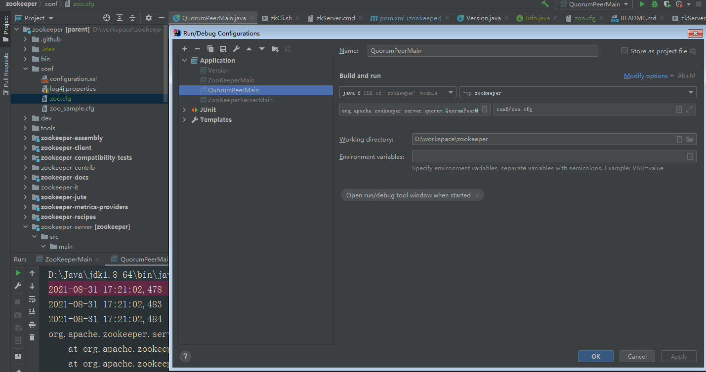

#### zookeeper源码下载
[https://github.com/apache/zookeeper][源码下载]

1.参考zoo_sample.cfg 新增 zoo.cfg到 zookeeper/conf 并新增启动参数 
2.查找zkServer.cmd文件 找到程序入口 QuorumPeerMain
3.启动程序 程序包org.apache.zookeeper.version不存在 zk版本号需要使用org.apache.zookeeper.Version#main生成
4.报错NoClassDefFoundError 需要将zookeeper-server/pom.xml <scope>provided</scope>标签删除，刷新maven

#### 使用客户端连接本地即可开始使用命令行操作 ./zkCli.sh -server localhost:2181